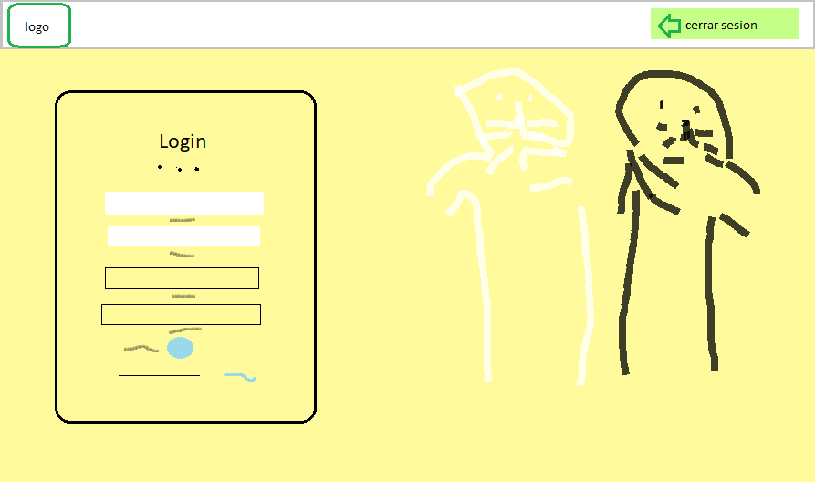
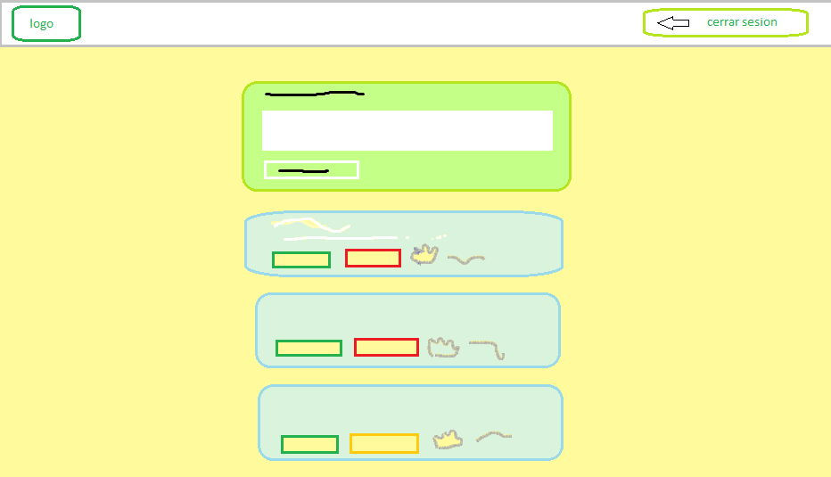

<h1><b>🐾ENTRE PATAS</b></h1>
<b>Definición:</b>
<h3>▷Muchas veces queremos tener un tiempo espacial que puedan brindar a nuestras mascotas a lo largo del tiempo que pasamos con ellos, es por esto surge la creación de  🐾ENTRE PATAS. </h3>
<h3> 🐾ENTRE PATAS es un red que fue creada con el propósito de poder postear algo referente a nuestros engreídos, esto gracias a la colaboración de los creadores por dedicar de su tiempo en la creación, como la búsqueda de un adecuado fondo de la página,como también tenemos la herramienta de firebase que nos da posibilidad de poder publicar en nuetra página diferentes anécdotas, para la parte de estilos utilizamos la eficaz herramienta que es bootstrap y como ultimo y no menos importante es hacer tanto html, css y js coincida para poder tener un buen resultado y que esto pueda ser gozado por los diferentes usuarios.</h3>

<b>Necesidad del usuario:</b>
<h3>Somos una red social que busca brindar un pequeño y cálido espacio a los diferentes usuarios amantes de las mascotas es será posible con el diseño de nuestra página, con la facilidad que poder postear, editar post y eliminarlo. </h3>

<b>Diseño de la Interfaz de Usuario:</b>
<h3>Registro, se aprecia en la parte superior nuestro logo que fue creado en Canva en la parte izquierda y en la parte de la derecha el icono de salida con un particular diseño que representa nuestra página, en la parte del medio podemos apreciar el registro que tienen como particular el poder registrarse con google.</h3>
<h3>Posteo, podemos apreciar un espacio en que se nos permite escribir seguido botones con diferentes diseños en la parte inferior con las opciones de publicar, editar el post, eliminar el post, dar like con un boton con un icono de huellita que fue obtenido de la página de loading. </h3>

<h2><b>Diseño de la red social:</b></h2>

  

  

